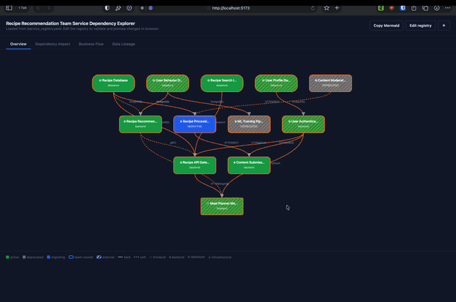

# Green Room

> A lightweight service registry explorer for on-call engineers and small platform teams.



## Features

- **Dependency impact analysis** — select any service and see everything downstream (or upstream) that breaks with it
- **Business flow overlay** — map services to the user journeys they power, filtered by stakeholder
- **Data lineage** — trace how a dataset or event travels through your system stage by stage
- **On-call quick-links** — surface runbooks, dashboards, incident channels, and SLOs directly from the service graph
- **Live validation** — paste or edit your registry in-browser; schema and cross-reference errors are highlighted instantly
- **Mermaid export** — copy the current graph as a Mermaid diagram with one click

## Quick start

```bash
npm install
npm run dev
```

## Your registry

Drop a `service_registry.yaml` into `public/` and the app loads it automatically. The file has four top-level sections:

| Section          | What goes here                                                                                                 |
| ---------------- | -------------------------------------------------------------------------------------------------------------- |
| `metadata`       | Team name, canonical `team_id`, maintainers, last-updated date                                                 |
| `business_flows` | Named user journeys with priority and stakeholder lists                                                        |
| `data_flows`     | Ordered stage pipelines — which service produces, queues, processes, stores, serves, and consumes each dataset |
| `services`       | One entry per deployable unit: type, status, upstream deps, business flows, and on-call links                  |

A minimal service entry:

```yaml
services:
  payments_api:
    name: Payments API
    description: Processes checkout transactions and refunds.
    type: backend
    status: active
    upstream:
      - service: payments_db
        protocol: PostgreSQL
        criticality: hard
    business_flows: [checkout]
    owner: payments_team
    runbook: https://wiki.example.com/runbooks/payments-api
    health_check: https://payments.example.com/health
    dashboard: https://grafana.example.com/d/payments-api
    on_call: Payments API - PagerDuty
    incident_channel: "#incidents-payments"
    slo: "99.9%"
```

### Service fields

| Field              | Required | Description                                                                                                      |
| ------------------ | -------- | ---------------------------------------------------------------------------------------------------------------- |
| `name`             | yes      | Human-readable display name                                                                                      |
| `description`      | yes      | What the service does and why it exists (1–2 sentences)                                                          |
| `type`             | yes      | `frontend` · `backend` · `worker` · `datastore` · `infrastructure`                                               |
| `status`           | yes      | `active` · `experimental` · `migrating` · `deprecated`                                                           |
| `upstream`         | yes      | Direct runtime dependencies (service key, protocol, `hard`/`soft` criticality)                                   |
| `business_flows`   | yes      | Keys of the business flows this service participates in                                                          |
| `owner`            | yes      | Registry key of the owning team — compared to `metadata.team_id` to distinguish your services from external ones |
| `runbook`          | yes      | URL to the on-call runbook (triage steps, failure modes, escalation)                                             |
| `health_check`     | yes      | URL to the health/readiness endpoint                                                                             |
| `port`             | no       | Primary listening port, for local development reference                                                          |
| `dashboard`        | no       | Observability dashboard URL (Grafana, Datadog, etc.) — first stop when paged                                     |
| `on_call`          | no       | PagerDuty service name, OpsGenie integration, or escalation policy URL                                           |
| `incident_channel` | no       | Primary Slack/Teams channel for incidents (e.g. `#incidents-payments`)                                           |
| `slo`              | no       | Availability target as a percentage or URL to the SLO doc (e.g. `99.9%`)                                         |

Full descriptions for every field, enum value, and constraint are embedded in `service_registry.schema.json` as `description` properties. Editors with JSON Schema support (VS Code, JetBrains) surface these as hover text and autocomplete.

### Customizing the schema

The schema lives in `service_registry.schema.json` (JSON Schema draft-2020-12). Services allow additional fields out of the box (`additionalProperties: true`), so you can attach team-specific metadata without touching the schema at all.

To **enforce** a custom field — for example, to require every service to declare a `tier` — edit the `$defs/service` definition in the schema: add the property to `properties` and its key to `required`. See the [JSON Schema docs](https://json-schema.org/understanding-json-schema) for the full vocabulary.

## Validation

Validation runs in two tiers: JSON Schema checks structural correctness and enum values, then `validateCrossReferences` in `src/domain/registry.ts` ensures every referenced service, business flow, and data flow stage resolves to a real key. Errors are pinned to source locations (line and column) in the editor pane.

## Contributing

Found a bug or have an idea? Open an issue using one of the templates:

- [Bug report](.github/ISSUE_TEMPLATE/bug_report.md)
- [Feature request](.github/ISSUE_TEMPLATE/feature_request.md)
